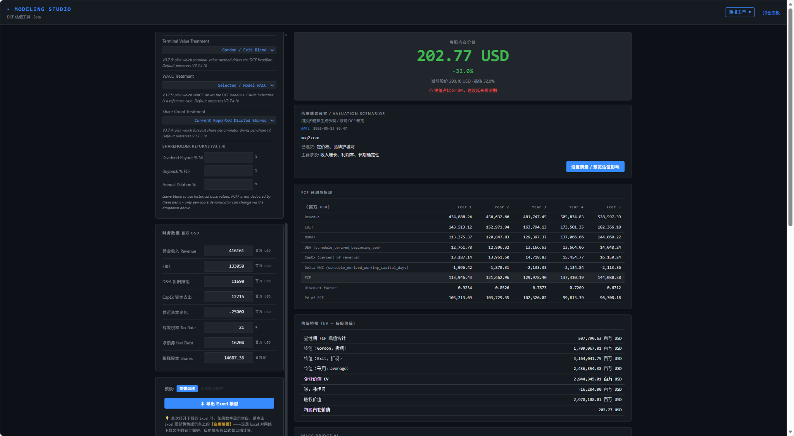
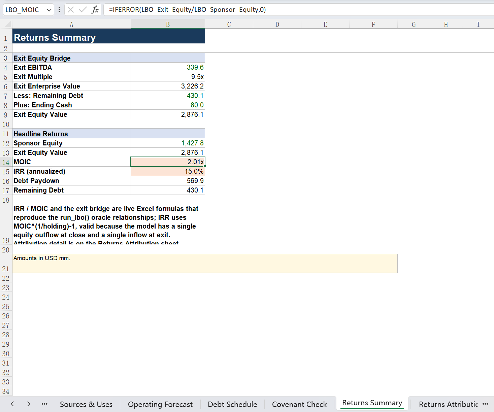
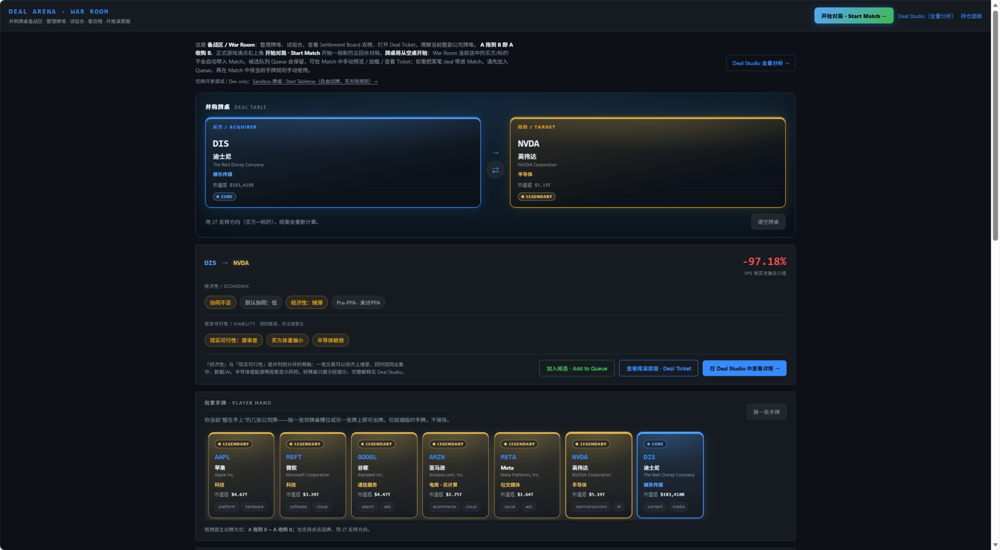

# Capital Studio｜资本建模工作台

A local-first financial modeling and M&A strategy lab — DCF, formula-native LBO workbook export, and deterministic M&A deal simulation.

本地优先（local-first）的金融建模与并购推演工作台，深色终端风格，支持港股 / 美股 / A 股。
集成三大模块：**DCF 估值看板**、**公式原生 LBO 工作簿导出**、**确定性 M&A 对战推演**。

> ⚠️ 仅供**教育与研究用途**，**非投资建议**。详见 [DISCLAIMER.md](DISCLAIMER.md)。

---

## 这是什么 / What this project is

- 一个 **local-first** 的金融建模 / 教育 / 研究工具：所有计算在本机完成。
- **非投资建议**（not investment advice）。
- 运行时**无券商 API、无 LLM 依赖、无插件依赖**；除抓取公开市场数据外不联网。
- 默认只监听 `127.0.0.1`，单用户本地使用。

---

## 三大核心模块 / Core modules

### 1. Equity / DCF Dashboard（股票与 DCF 估值看板）
- 组合概览、持仓盈亏、多币种（HKD / USD / CNY）、个股详情与历史行情。
- 完整的 **DCF（Discounted Cash Flow）** 估值器：假设驱动的现金流预测、Bull / Bear
- 导出的 Excel 工作簿是 **formula-native**（公式原生）：单元格里是**活公式**而非写死的
  数值，可在 Excel 中直接联动重算。
  情景管理、敏感性分析、数据质量审计，以及 **Excel 导出**。

### 2. Formula-native LBO Workbook（公式原生 LBO 工作簿）
- **LBO（Leveraged Buyout）** 建模引擎：进入/退出假设、多档债务瀑布、税盾、回报归因、
  情景与敏感性。
- 导出的 Excel 工作簿是 **formula-native**（公式原生）：单元格里是**活公式**而非写死的
  数值，可在 Excel 中直接联动重算；并带契约（covenant）/ 到期（maturity）/ 审计防御层。

### 3. Deterministic M&A Game Arena（确定性并购对战推演）
- 把并购分析卡牌化的 **M&A Deal Arena**：公司卡组（seed deck）、协同（synergy）/
  可行性（viability）引擎、A&D（accretion/dilution）引擎、对局与结算逻辑。
- **完全确定性（deterministic）**：seed / precompute 逻辑，相同输入恒得相同输出，
  **不依赖 LLM / 插件 / broker API**。

---

## 快速开始 / Quick start

```bash
# 1. 创建并激活虚拟环境
python -m venv .venv
source .venv/bin/activate        # macOS / Linux
.venv\Scripts\activate           # Windows

# 2. 安装运行时依赖
pip install -r requirements.txt

# 3. 启动
python app.py
```

终端显示 `* Running on http://127.0.0.1:5000` 后，打开浏览器访问
[http://127.0.0.1:5000](http://127.0.0.1:5000)。

---

## 主要页面路由 / Main routes

| 路由 | 页面 |
|------|------|
| `/` | 首页：组合概览 + 持仓列表 |
| `/detail` | 个股详情页 |
| `/modeling/dcf` | DCF 估值器 |
| `/modeling/dcf/select` | DCF 情景选择 |
| `/modeling/lbo` | LBO 建模 + 工作簿导出 |
| `/modeling/ma` | M&A Studio |
| `/modeling/ma/arena` | Deal Arena 对战 |
| `/modeling/ma/arena/play` | Arena 对战桌面 |
| `/modeling/ma/arena/match/setup` | Arena 对局设置 |

---

## 测试 / Testing

```bash
pip install -r requirements-dev.txt
pytest
```

当前基线：**1136 个测试全部通过**（R2 安全加固后；若重跑后数量变化，以实际结果为准）。
覆盖 DCF、LBO（含 formula-native workbook 导出）、M&A Arena（含 API contract、precompute、
对局生命周期）以及货币 / 期间 / 审计类回归。

---

## 数据源 / Data sources

| 市场 | 来源 | 代码格式示例 |
|------|------|--------------|
| 美股 | yfinance（Yahoo Finance） | `AAPL` |
| 港股 | yfinance | `0700.HK` |
| A 股（上交所） | akshare | `600519.SS` |
| A 股（深交所） | akshare | `000858.SZ` |

- 行情 / 财务数据均来自**公开、免密钥**来源。
- **M&A Arena 不联网**：使用确定性 seed / precompute 逻辑，运行时无 LLM / 插件 / broker 依赖。

---

## 架构 / 模块地图 / Architecture map

数据流：`yfinance / akshare → data_fetcher* / calculator → modeling/* 引擎 → Flask API → static 前端`

```
app.py                  # Flask 入口：所有路由 + API（Equity / DCF / LBO / M&A）
data_fetcher*.py        # 数据层：yfinance / akshare / 历史数据封装
calculator.py           # 基础金融计算（盈亏、收益率、组合汇总）

modeling/
├── dcf_calculator.py   # DCF 引擎
├── excel_exporter.py   # DCF Excel 导出
├── templates/          # 导出用模板（goldman_dcf）
├── lbo_*.py            # LBO 引擎 + formula-native workbook 导出
├── data_quality.py /   # DCF 数据质量与行业分类
│   industry_classification.py
└── ma/                 # 确定性 M&A Arena：seed deck、协同/可行性引擎、
                        #   A&D engine、对局逻辑、precompute

static/                 # 前端页面与 JS（index / detail）
└── modeling/           # DCF / LBO / M&A Arena 前端页面与 JS

data/
├── ontology/drivers.json   # tracked seed 数据（随仓库发布）
├── cache/                  # 本地行情/财报缓存（gitignore）
├── thesis/                 # 投研 thesis 本地状态（gitignore）
└── dcf_scenarios/          # DCF 情景本地状态（gitignore）

portfolio.json          # 本地持仓状态（gitignore，不随仓库发布）
tests/                  # 回归与 contract 测试套件
```

---

## 安全与隐私边界 / Security & privacy posture

- **默认本地化**：监听 `127.0.0.1`，不对外暴露。
- **Debug 默认关闭**：仅在显式设置 `FLASK_DEBUG=1` 时开启（避免 Werkzeug 调试器 RCE 面）。
- **CORS 仅回环（loopback）**：`/api/*` 只允许 `127.0.0.1` / `localhost` 来源。
- **API 错误不泄露内部细节**：异常写服务端日志，前端只见通用错误信息。
- **前端 XSS 防护**：对行情 / URL / 用户来源字段做 HTML 转义；持仓表用 data-* 属性 +
  事件委托，不把字段拼进行内脚本。
- **本地状态不入库**：`portfolio.json`、`data/cache`、`data/thesis`、`data/dcf_scenarios`
  等本地持仓 / 缓存 / 状态均被 gitignore，不随仓库发布。

---

## 已知限制 / Known limitations

- 市场数据依赖第三方公开来源，可能延迟、缺失、被修订或不可用；yfinance / akshare 有访问
  频率限制，港股 / A 股首次抓取较慢（之后本地缓存）。
- 仅供教育 / 研究用途，**非生产级投资建议**。
- 所有输出为基于假设与公开数据的**模型估计 / 模拟**结果。
- **不提供任何担保**（no warranty，见 [LICENSE](LICENSE)）。
- 无券商集成、不执行任何真实交易。

---

## 截图 / Screenshots

注：以下为 Capital Studio 真实产品界面截图，更多截图见 assets/screenshots/。

### DCF Dashboard — DCF 估值工作台
中文估值工作台：公司信息、假设参数（WACC、终值方法、运营预测）与 Excel 导出。



### Formula-native LBO Workbook — 公式原生 LBO 工作簿
LBO 引擎 + 导出的 Excel 工作簿，单元格为**活公式**（formula-native），可在 Excel 中联动重算。



### Deterministic M&A Arena — 确定性并购对战
并购牌桌、公司牌堆（seed deck）与玩家手牌；**完全确定性**，运行时无 LLM / 插件 / broker 依赖。



---

## License

本项目以 **MIT License** 发布，详见 [LICENSE](LICENSE)。

## Disclaimer

仅供教育与研究用途，**非投资 / 财务 / 法律 / 税务 / 会计 / 交易建议**，不提供任何担保。
完整免责声明见 [DISCLAIMER.md](DISCLAIMER.md)。
